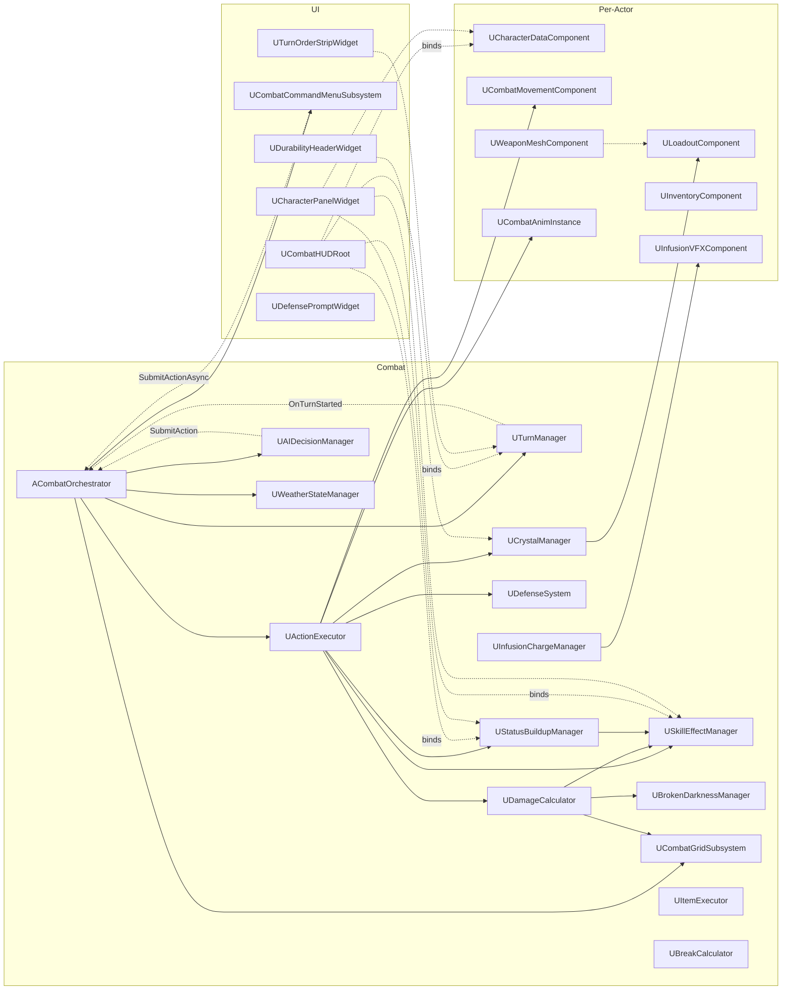
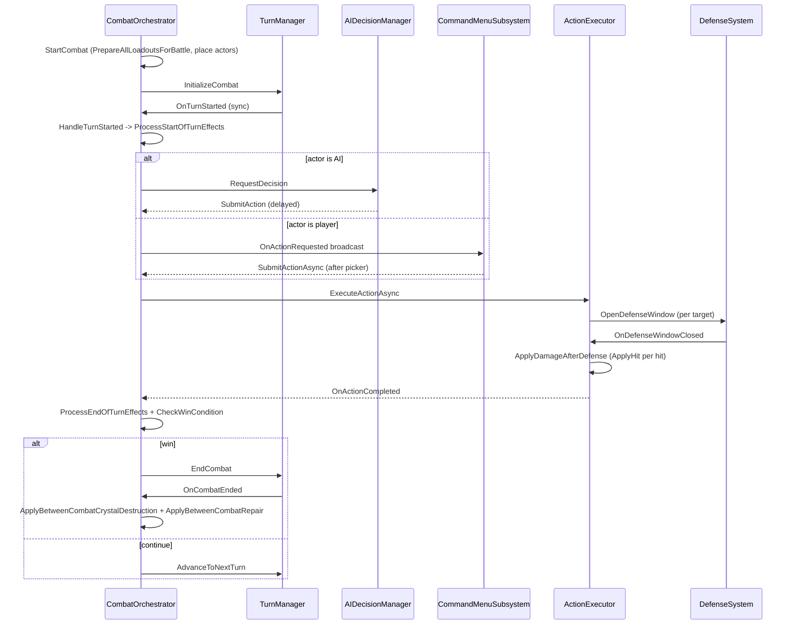
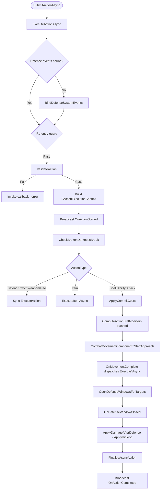

# World of Refraction — Architecture
Last updated: 2026-05-14
Branch: main
Scope: Full codebase

## 0. How to Read This Document

This is the ground truth of how *World of Refraction* is built today — one document, code-referenced, scannable. Sources, in priority order: (1) headers and `.cpp` under `Source/world_of_refraction/`, (2) `docs/PastDocumentation_Audit.md` Superseded/Abandoned sections, (3) locked design docs under `docs/PastDocumentation/May2026/*_Locked.md`. Code wins when docs disagree — disagreements are listed in §18 Known Drift.

Navigate by domain: §1 system map, §2 module layout, §3 data model, §4–§12 combat internals, §13 UI, §14 out-of-combat, §15 debug tools, §16 delegate inventory, §17 design pointers. **If something feels missing, check §18 (Known Drift) and §19 (Not Yet Implemented) first — most "where's X?" answers live there.** §20 is the cold-start summary for returning to the codebase.

## 1. System Map

Combat is event-driven, no tick loop. `ACombatOrchestrator` is the placed-actor coordinator; `UTurnManager` owns turn order; `UActionExecutor` runs the action pipeline; `UDamageCalculator` / `UDefenseSystem` / `USkillEffectManager` / `UStatusBuildupManager` / `UCrystalManager` / `UBrokenDarknessManager` / `UInfusionChargeManager` / `UItemExecutor` / `UWeatherStateManager` / `UCombatGridSubsystem` / `UAIDecisionManager` are stateless or per-actor services hosted as `UGameInstanceSubsystem`s. UI lives under `UI/Combat/`. Per-character components (`UCharacterDataComponent`, `ULoadoutComponent`, `UInventoryComponent`, `UCombatMovementComponent`, `UWeaponMeshComponent`, `UInfusionVFXComponent`, `UBrokenDarknessManager` (component), `UCombatAnimInstance` (anim instance)) hold runtime state on the actor.



## 2. Module Structure

Single C++ module: `world_of_refraction`. Build target inherited from project name. UBT auto-includes subdirectories, so `#include` paths don't change after moves within the module.

```
Source/world_of_refraction/
  Public/                    # headers — flat, ~80 files at root
    UI/Combat/               # combat-only widgets
      CommandMenu/           # action menu sub-widgets
    Testing/                 # HUDTestActor only
  Private/                   # implementations, mirror layout
    UI/Combat/CommandMenu/
    Testing/
```

Public root holds **all** combat-domain headers (subsystems, components, data assets, structs, enums, helpers). Only UI gets a subfolder. Notable groupings:

| Concern | Headers |
|---|---|
| Subsystems | `ActionExecutor`, `AIDecisionManager`, `BrokenDarknessManager` (component+manager dual role), `CombatGridSubsystem`, `CrystalManager`, `DamageCalculator`, `DefenseSystem`, `InfusionChargeManager`, `ItemExecutor`, `RingManager`, `SkillEffectManager`, `StatusBuildupManager`, `TurnManager`, `WeaponManager`, `WeatherStateManager` |
| Per-actor components | `CharacterDataComponent`, `LoadoutComponent`, `InventoryComponent`, `CombatMovementComponent`, `WeaponMeshComponent`, `InfusionVFXComponent`, `BrokenDarknessManager` (also Component) |
| Data assets | `AbilityData`, `CharacterData`, `EquipmentDataBase`, `ItemData`, `LoadoutData`, `MovementData`, `RingData`, `SkillDataBase` / `CastableSkillDataBase`, `SpellData`, `StanceData`, `WeaponAttackData`, `WeaponData` |
| Runtime structs | `ActionStructs`, `ActionStatModifiers`, `ActiveSkillEffect`, `FAbilityCollection`, `FCombatGridPosition`, `FCombatLoadout`, `FCrystalInventoryEntry`, `FEquipmentStatBonus`, `FItemCrystalInventory`, `FItemLoadoutSlot`, `FRingInventoryEntry`, `FRingLoadoutEntry`, `FSkillEffect`, `FSpellCollection`, `FWeaponInventoryEntry`, `FWeaponLoadoutEntry`, `FPillarWeights` |
| Enums | ~25 `E*.h` files (one enum per file) |
| Constants | `CombatConstants`, `CombatGridConstants`, `Durabilityconstants`, `InfusionConstants`, `InventoryConstants`, `ItemConstants`, `LoadoutConstants`, `StatConstants`, `AIDecisionConstants` |
| Debug pairs | `<DataAsset>Debug.h/.cpp` per data asset; see §15 |
| Utility | `ActionUtils`, `BarCapTriggerResolver`, `ElementColors`, `ElementHelpers`, `EquipmentBonusGenerator`, `HybridSpellColors`, `InfusionCostHelper`, `SkillEffectDisplayNames`, `SkillTriggerUtils`, `RealityBoost`, `WorldStatRequirements` |

No subsystem boundaries below the module — everything links into one library. Per CLAUDE.md, UBT auto-includes subdirectories so files can be moved within the module without touching `#include`s.

## 3. Data Model

### 3.1 Immutable templates (UPrimaryDataAsset)

| Asset | Header | Purpose | Read by |
|---|---|---|---|
| `UCharacterData` | `CharacterData.h:51` | Identity, class, innate element, stat-point distribution (Mind/Body/Spirit), default loadout, defense montages, `EquippedWeatherVariant` | `CharacterDataComponent`, `WeatherStateManager`, AI |
| `UWeaponData` | `WeaponData.h:28` | Type, physical damage type, attack ref, preset abilities, stance, mesh | `FWeaponInventoryEntry`, `LoadoutComponent`, `WeaponMeshComponent` |
| `UWeaponAttackData` | `WeaponAttackData.h:29` | Hit distribution, attack montage, approach `UMovementData`, range | `LoadoutComponent::GetCurrentAttack`, `ActionExecutor` |
| `USpellData` | `SpellData.h:36` | Element, school, delivery (Projectile/Homing/Beam/Instant), raw-mode flag, construct fields, `RequiredEvolutionCrystal` | `ActionExecutor`, `DamageCalculator`, AI |
| `UAbilityData` | `AbilityData.h:33` | Weapon-bound skill, Melee/Ranged, infusion mults, authored `StatusBuildup` | `ActionExecutor`, AI |
| `URingData` | `RingData.h:22` | Ring template with preset spells, `bSpellsLocked`, mesh | `FRingInventoryEntry`, Resonator loadout |
| `UItemData` | `ItemData.h:46` | Hybrid — refined-crystal / item-crystal / evolution-crystal authoring; `bIsRefined`, `bIsEvolutionCrystal`, `Tier`, `BaseStatBonus`, `Effects`, per-tier consumable value ladders, `MaxDurability` seed | `ItemExecutor`, `CrystalManager`, infusion paths |
| `ULoadoutData` | `LoadoutData.h:50` | Pre-built loadout template (primary slot type, weapons/rings/evolution, abilities, spells, items), `bShowPrimary` | `LoadoutComponent::InitializeFromAsset`, `FCombatLoadout::CreateFromAsset` |
| `UStanceData` | `StanceData.h:18` | Idle pose template (montage + icon) | `CombatAnimInstance` |
| `UMovementData` | `MovementData.h:22` | Approach motion (Direct/Dash/Teleport, speed mult, montages, VFX, sound) | `CombatMovementComponent`, attack/ability data |
| `UInfusionDisplayData` | `InfusionDisplayData.h` | Per-source display palette (colour, icon, label) consulted by `CombatCommandMenuSubsystem` button builders | menu, VFX |

Abstract bases: `USkillDataBase`, `UCastableSkillDataBase`, `UEquipmentDataBase` (`EquipmentDataBase.h:42`) — the last hosts `SlottedCrystal`, `DefaultSpells`, `BaseStatBonus`, `GeneratedStatBonus`, `Effects`, `Requirements` for weapons + rings.

`UItemData` editor-side `Display*` mirror fields are recomputed in `PostEditChangeProperty`; legacy pillar-percent fields auto-migrate to `BaseStatBonus` in `PostLoad` (`ItemData.cpp:849`).

### 3.2 Runtime state (USTRUCT)

| Struct | Header | Purpose |
|---|---|---|
| `FCombatLoadout` | `FCombatLoadout.h:46` | Active loadout owned by `LoadoutComponent::SavedLoadouts`; primary/secondary slot entries, ring loadout, item slots, innate spells, `bShowPrimary` |
| `FWeaponInventoryEntry` | `FWeaponInventoryEntry.h:34` | Per-instance weapon — atomic `InstanceID`, `AttachedCrystal`, `AssignedSpells`, per-instance `StatBonus` |
| `FRingInventoryEntry` | `FRingInventoryEntry.h:38` | Per-instance ring — same structure |
| `FCrystalInventoryEntry` | `FCrystalInventoryEntry.h:25` | Per-instance crystal — `CurrentDurability`, `FGuid InstanceID` |
| `FWeaponLoadoutEntry` | `FWeaponLoadoutEntry.h:28` | Wraps inventory entry + `AssignedAbilities` for combat |
| `FRingLoadoutEntry` | `FRingLoadoutEntry.h:22` | Wraps inventory entry; exposes locked-vs-customisable spell partitioning |
| `FItemLoadoutSlot` | `FItemLoadoutSlot.h:26` | One item slot: `Crystal`, `RemainingUses` (default 3) |
| `FItemCrystalInventory` | `FItemCrystalInventory.h:29` | Per-tier crystal arrays (UHT-friendly TMap replacement, caps F=25…S=3) |
| `FAbilityCollection` | `FAbilityCollection.h:26` | Owned-abilities (50 cap) |
| `FSpellCollection` | `FSpellCollection.h:26` | Owned-spells (50 cap) |
| `FEquipmentStatBonus` | `FEquipmentStatBonus.h:43` | 13 substat ints (±21) + `BonusCritChance` float + 3 pillar percent (±15) |
| `FAction` | `ActionStructs.h:27` | Submitted action: type, targets, asset refs, `SelectedSource`, `Spell/AbilityInfusionLevel` |
| `FActionExecutionContext` | `ActionStructs.h:365` | Async per-action state — `PartialResult`, `PendingDefenses`, `ActionMods` |
| `FActionHitInput` | `ActionStructs.h:491` | Single-hit applicator input — passed to `ApplyHit` |
| `FCombatHitResult` | `ActionStructs.h:425` | Single-hit output — damage/healing/crit/blocked/parried/dodged/died |
| `FActionStatModifiers` | `ActionStatModifiers.h:33` | 9-substat float-% modifier set + `Accumulate`/`AddFlatPercent`/`GetModifier`/`IsActive` (per `PerAction_Stat_Modifiers_Locked.md`) |
| `FPendingDefenseContext` | `ActionStructs.h:284` | Per-defense window state |
| `FCombatGridPosition` | `FCombatGridPosition.h:16` | Team/row/column with row-driven damage/defense mods |
| `FActiveSkillEffect` | `ActiveSkillEffect.h:27` | Per-effect runtime: type, element, source ID, magnitude, duration, stacks, triggers |
| `FStatusBarState` | `StatusBuildupManager.h:51` | Single buildup bar per actor — pending element/physical type, decay state |
| `FCombatCapabilities` | `UI/Combat/FCombatCapabilities.h:20` | Snapshot of what an actor can do this turn — built once per `OpenForActor` |
| `FPieMenuButtonData` | `UI/Combat/PieMenuButtonData.h:88` | Menu button payload — `Category`, `DataReference`, `Targets[]` |
| `FEquippedCrystalSlot` | `LoadoutComponent.h` | (Holder, Crystal) pair returned by `GetEquippedCrystals` |
| `FQuartzAbsorptionState` | `ItemExecutor.h` | Per-actor Quartz absorption record |

Three-layer ownership: `UEquipmentDataBase` (template) → `F*InventoryEntry` (owned, mutable per-instance state) → `F*LoadoutEntry` (assigned to combat slot). Spells live on inventory entries; ring locked-spell partitioning derives from `URingData::bSpellsLocked`.

### 3.3 Enums

| Enum | Header | Range / values |
|---|---|---|
| `ESpellElement` | `ESpellElement.h` | Generic, Fire, Water, Earth, Wind, Light, Darkness, Lightning, Void, Reality, BrokenDarkness |
| `ECharacterClass` | `ECharacterClass.h` | Generic, Caster (display "Refractor"), Resonator |
| `EActionType` | `EActionType.h` | None, Attack, Spell, Ability, Item, Defend, SwitchWeapon, SwitchRing, Flee |
| `EPhysicalDamageType` | `EPhysicalDamageType.h` | Slash, Pierce, Impact |
| `EWeaponType` | `EWeaponType.h` | Sword, Dagger, Staff, etc. (designer-tunable) |
| `EWeaponSlotType` | `EWeaponSlotType.h` | None, Primary, Secondary |
| `EEvolutionType` | `EEvolutionType.h` | Pillar / SubStats (governs which authored stat fields read) |
| `EInfusionSourceOption` | `EInfusionSourceOption.h` | None, Raw, Innate, ActiveRing, PrimaryRing, WeaponCrystal, Evolution |
| `EChargeInfusionType` | `EChargeInfusionType.h` | None, Physical, Element (preserved from earlier design) |
| `ESpellSource` | `ESpellSource.h` | None, Weapon, RingCrystal, Innate, Evolution (post-rename) |
| `ESkillEffectType` | `ESkillEffectType.h` | ~100 values — core triggers (DOT, SkipTurn, etc.), pillar/substat buffs/debuffs, immunities (per-trigger + per-element), passive layer (ModifyDamageDealt etc.), special (DoubleHit, Revive, IgnoreDefense) |
| `ESkillTrigger` | `ESkillTrigger.h` | OnCast, OnHit, OnKill, OnTakeDamage, OnTurnStart, OnTurnEnd, etc. |
| `ESkillEffectTiming` | `ESkillEffectTiming.h` | Immediate, Triggered, OverTime |
| `EDefenseType` / `EDefenseDirection` | `EDefenseType.h` / `EDefenseDirection.h` | Block/Parry/Dodge × Up/Down/Left/Right/Center |
| `ECombatMovementType` | `ECombatMovementType.h` | None, Direct, Dash, Teleport |
| `ECombatRow` | `ECombatRow.h` | Front, Middle, Back |
| `ECombatCameraState` / `EActionCameraPhase` | `ECombatCameraState.h` / `EActionCameraPhase.h` | Home, Character, Selection, Action / Approach, Execute, Return |
| `EAIDifficulty` | `EAIDifficulty.h` | Easy, Medium, Hard |
| `EItemEffectType` | `ItemEffectType.h` | Damage, Heal, Energy, BuffMind, BuffBody, BuffSpirit, DebuffStat, Gamble (Amethyst), Cleanse, Absorb (Quartz) |
| `EItemTier` | `ItemTier.h` | F, E, D, C, B, A, S |
| `ESpellDeliveryType` | `ESpellDeliveryType.h` | Projectile, Homing, Beam, Instant |
| `EAbilityExecutionType` | `EAbilityExecutionType.h` | Melee, Ranged |
| `ETargetType` | `TargetType.h` | Self, SingleEnemy, AllEnemies, SingleAlly, AllAllies, etc. |
| `ECrystalType` | `CrystalType.h` | Refined / Evolution / ItemCrystal categorisation |
| `EStatScalingType` | `EStatScalingType.h` | Linear, Diminishing |
| `EMovementCategory` | `EMovementCategory.h` | grouping for `UMovementData` selection |
| `EInfusionDisplayLocation` | `EInfusionDisplayLocation.h` | Where infusion preview renders (HP bar, status bar, durability bar) |

## 4. Combat — Turn Lifecycle



Entry: `ACombatOrchestrator::StartCombat` (`CombatOrchestrator.cpp:113`). Sequence: register AI/menu subsystem refs, place actors via `UCombatGridSubsystem::AutoAssignTeam`/`PlaceAllActors`, `UWeatherStateManager::InitialiseLeaders`, bind `TurnManager` events, `TurnManager->InitializeCombat`, fire BP `OnCombatStartedUI`, `CombatCameraManager->InitializeForCombat`.

End: `ACombatOrchestrator::OnActionCompleted` (`CombatOrchestrator.cpp:493`) → win-check; on win: `SkillEffectManager->ClearAllEffects`, `ApplyBetweenCombatCrystalDestruction` (`:1093` — nulls `SlottedCrystal` on weapon/ring holders for broken refined crystals; evolution holders immune), `ApplyBetweenCombatRepair` (`:1168`), `TurnManager->EndCombat`, broadcast `OnCombatResultReady`.

Drift: `UTurnManager::OnTurnEnded` is declared (`TurnManager.h:58`) but **never broadcast**; end-of-turn work lives entirely in `OnActionCompleted`. `HandleTurnEnded` bind at `CombatOrchestrator.cpp:651` is dead. See §18.

## 5. Combat — Subsystems

### `UTurnManager` (UGameInstanceSubsystem)
- `TurnManager.h:73`. Debt-based turn ordering. Responsibility: maintain debt ledger, decide next actor, expose preview.
- API: `InitializeCombat`, `EndCombat`, `AdvanceToNextTurn`, `GetCurrentActor`, `PreviewTurnOrder(N)`, `IsCombatActive`, `OnActorSpeedChanged`, `OnActorDied/Resurrected`, `RequestExtraTurn`.
- Broadcasts: `OnTurnStarted(Actor,int)` (`TurnManager.cpp:131`), `OnCombatEnded(WinningTeam)` (`:90`), `OnSpeedChanged(Actor)` (`:366`). `OnTurnEnded` declared, never broadcast.
- Deps: `UCharacterDataComponent` (stats), `ULoadoutComponent::GetActiveStatBonus`, `USkillEffectManager` (turn-speed modifiers).
- File: `TurnManager.h/.cpp`.

### `ACombatOrchestrator` (placed AActor)
- `CombatOrchestrator.h:86`. Combat coordinator. Responsibility: own teams, start/end combat, route player vs AI actions, run between-combat housekeeping.
- API: `StartCombat(Team0,Team1,Difficulty)`, `ForceEndCombat`, `SubmitAction`/`SubmitActionAsync`, `ValidateAction`, `IsActorAIControlled`, `GetLivingEnemies/Allies`, ~20 `CallInEditor` debug methods.
- Broadcasts: `OnCombatStateChanged`, `OnCombatResultReady`, `OnActorTurnStarted`, `OnActionRequested`, `OnActionExecuted`, BP `OnCombatStartedUI`.
- Consumes: `TurnManager::OnTurnStarted/OnTurnEnded/OnCombatEnded` (`CombatOrchestrator.cpp:651-653`).
- File: `CombatOrchestrator.h/.cpp`.

### `UActionExecutor` (UGameInstanceSubsystem)
- `ActionExecutor.h`. Action pipeline — see §7. Single in-flight action; `TOptional<FActionExecutionContext>`.
- Public events: `OnActionStarted`, `OnActionCompleted`, `OnDamageDealt`, `OnHealingDone`, `OnTargetKilled`, `OnAsyncActionCompleted`.

### `UDamageCalculator` (UGameInstanceSubsystem)
- See §8.

### `UDefenseSystem` (UGameInstanceSubsystem)
- See §8.

### `USkillEffectManager` (UGameInstanceSubsystem)
- `SkillEffectManager.h`. Central per-actor `TArray<FActiveSkillEffect>` map.
- API: `ApplyEffect`, `ApplyEvolutionEffects`, `ApplyEquipmentEffects`, `ApplyWeaponBonuses`/`ApplyRingBonuses`, `ApplyPhysicalDamageEffect`, `ProcessStartOfTurnEffects`/`ProcessEndOfTurnEffects`/`ProcessTriggerEffects`, `ApplyImmediateSkillEffect`/`ApplyTriggeredSkillEffect`, `GetEffectsByType`, `GetTotalStatModifier`, `HasEffectOfType`, removal helpers.
- Broadcasts: `OnEffectApplied/Removed/Triggered/StacksChanged/DurationChanged`.
- Consumes: `UActionExecutor::OnDamageDealt` (`SkillEffectManager.cpp:35`) for Lifesteal / ApplyBurn / Chill / Stun-on-crit (`:1269-1324`).
- Effect-ID namespacing: equipment `SourceID*100+i`, weapon bonuses `WeaponID*100+1..+6`, ring bonuses `RingID*100+50+i`, physical-status `WeaponID*10+7`, infusion DOTs `AbilityID*10+5`.
- File: `SkillEffectManager.h/.cpp`.

### `UStatusBuildupManager` (UGameInstanceSubsystem)
- `StatusBuildupManager.h`. Per-actor `FStatusBarState` (single bar, no per-element split). `PendingElement`/`PendingPhysicalType` are "most recent hit wins".
- API: `AddStatusBuildup`, `GetStatusBarPercent`, `GetPendingTrigger`, `ResetStatusBar`, `ProcessStatusBarDecay`, `GetTotalElementResistance`.
- Broadcasts: `OnStatusBuildupChanged(Actor,Current,Max,PendingElement)`.
- Bar-cap trigger resolved live via `BarCapTriggerResolver::ResolveTrigger`; fire path is `TriggerSkillEffectFromBuildup` → `SkillEffectManager::ApplyTriggeredSkillEffect` (no dedicated trigger delegate).
- File: `StatusBuildupManager.h/.cpp`.

### `UCrystalManager` (UGameInstanceSubsystem)
- `CrystalManager.h:16`. Unified post-cast wear path (replaces former wear in `WeaponManager`/`RingManager`).
- API: `ProcessPostCastWear(Actor, Crystal, Holder, ActionTier, InfusionLevel, bIsSpell)`.
- Broadcasts: `OnCrystalBroken(Actor,Holder,Crystal)` (`CrystalManager.cpp:120`), `OnCrystalDurabilityChanged(Actor,Holder,Cur,Max)` (`:110`).
- Stateless — durability lives on `FCrystalInventoryEntry` resolved via `LoadoutComponent::FindCrystalEntryByHolder`. Luck-driven skip roll inside.
- File: `CrystalManager.h/.cpp`.

### `UBreakCalculator` (UBlueprintFunctionLibrary)
- `BreakCalculator.h:45`. Static. `CalculateDurabilityWear(CrystalTier,ActionTier,InfusionLevel,bIsSpell)` — tier-mismatch wear (+3 per gap when action>crystal) + infusion wear (spell L1=6/L2=12, ability L1=4/L2=8). `CUSTOM_SPELL_WEAR=2` constant defined but unused (see §18).

### `URingManager` (UGameInstanceSubsystem)
- `RingManager.h:25`. Thin LoadoutComponent façade + auto-switch on ring break.
- API: `GetActiveRing`, `GetActiveElement`, `GetPrimaryRing`, `SwitchToNextRing`.
- Consumes: `UCrystalManager::OnCrystalBroken` (filters by `Cast<URingData>(Holder)`, calls `SwitchToNextRing`).

### `UWeaponManager` (UGameInstanceSubsystem)
- `WeaponManager.h:28`. Thin LoadoutComponent façade.
- API: `GetActiveWeapon`, `GetActiveAttack`. No wear, no delegates in active code.
- `FWeaponAttackResult` + `FOnWeaponAttackExecuted` declared in header but never broadcast (dead — §18).

### `UAIDecisionManager` (UGameInstanceSubsystem)
- See §11.

### `UItemExecutor` (UGameInstanceSubsystem)
- `ItemExecutor.h`. Crystal item effects (10 types per `EItemEffectType`), per-class bonuses, S-tier secondaries, Amethyst gamble, Quartz absorption.
- API: `UseItem(User,Item,Target)`, `UseItemMultiTarget`, `RegisterQuartz`/`UnregisterQuartz`, `NotifyQuartzDamage`, `CanQuartzTransform`, `TransformQuartz`.
- Broadcasts: `OnItemUsed`, `OnQuartzTransformed`, `OnGambleResult`.
- State: `TMap<TWeakObjectPtr<AActor>, FQuartzAbsorptionState> QuartzStates`.

### `UInfusionChargeManager` (UGameInstanceSubsystem)
- `InfusionChargeManager.h:111`. Hold-to-charge timing → level (0/1/2). State-only; no cost mutation (Locked: costs apply at commit, not during cycling).
- API: `BeginCharge`, `CompleteCharge`, `CancelCharge`, `UpdateCharge`, `GetChargeStatus`, `SetChargeLevel`, `ApplyChargeToAction`.
- Broadcasts: `OnChargeStarted/LevelChanged/Complete/Cancelled`.

### `UWeatherStateManager` (UGameInstanceSubsystem)
- See §12.

### `UCombatGridSubsystem` (UGameInstanceSubsystem)
- `CombatGridSubsystem.h:21`. 3×3-per-team grid. `TMap<AActor*, FCombatGridPosition> ActorPositions`. Row-driven damage/defense modifiers.
- API: `AssignPosition`, `RemoveFromGrid`, `GetActorPosition`, `GetDamageModifier`, `GetDefenseModifier`, `CalculateWorldPosition`, `PlaceAllActors`, `AutoAssignTeam`, `UpdateActorFacing`, `GetFacingTarget`, row movement helpers (BP-callable, §18 unused-by-C++ flag).

### `UCombatCommandMenuSubsystem` (UGameInstanceSubsystem)
- See §13.

### `ACombatCameraManager` (placed AActor)
- `CombatCameraManager.h`. Owns combat-camera states (Home/Character/Selection/Action). Binds `UTurnManager::OnTurnStarted` for Character focus. Action-phase bindings to `UActionExecutor::OnActionStarted`/`OnActionCompleted` are TODO-commented at `CombatCameraManager.cpp:77-79, 464, 470, 476` — see §18.

## 6. Combat — Components

| Component | Owner | Header | Role |
|---|---|---|---|
| `UCharacterDataComponent` | every combatant | `CharacterDataComponent.h:26` | HP/EP/MaxHP/MaxEP/Alive; replicated |
| `ULoadoutComponent` | every combatant | `LoadoutComponent.h:71` | Saved loadouts + combat-time queries (`GetActiveWeapon`, `GetActiveStatBonus`, `GetEquippedCrystals`, `FindCrystalEntryByHolder`) |
| `UInventoryComponent` | every combatant | `InventoryComponent.h:37` | Out-of-combat storage of spells/abilities/weapons/rings/items |
| `UCombatMovementComponent` | every combatant | `CombatMovementComponent.h:49` | Per-actor approach/execute/return movement |
| `UWeaponMeshComponent` | every combatant | `WeaponMeshComponent.h:15` | Polling-driven (0.1s) mesh sync to active weapon |
| `UInfusionVFXComponent` | every combatant | `InfusionVFXComponent.h:26` | Niagara VFX driven by `InfusionChargeManager` delegates |
| `UBrokenDarknessManager` | Caster only | `BrokenDarknessManager.h` | Per-actor BD state — also documented as a "subsystem service" by callers but is an `UActorComponent` |
| `UCombatAnimInstance` | every combatant skeletal mesh | `CombatAnimInstance.h:16` | Three-tier montage manager: stance / action / movement |
| `UElementColorDebugComponent` | optional, editor | `ElementColorDebugComponent.h` | Renders 9-element colour swatches at runtime for tuning |

### `UCharacterDataComponent`
Replicated. Owns `CurrentHP`, `CurrentEP`, `MaxHP`, `MaxEP`, `bIsAlive`, `bIsBrokenDarkness`. API: `InitializeFromTemplate`, `ResetToMax`, `RecomputeMaxPools` (reads `LoadoutComponent::GetActiveStatBonus`), `ServerTakeDamage/Heal/SetHP`, `ServerSpendEnergy/GainEnergy/SetEP` (Resonator-without-target suppression), `ServerResurrect`, `GetActiveWeapon` (forwards), `HasUsableEPTarget`, `IsBrokenDarkness`, `GetCrystalModifiedMind/Body/Spirit`, `GetEquipmentModifiedLuck`, `GetCrystalModifiedSpellDamage/RawDamage/CritChance/FlatDefense/EfficiencyMultiplier`. Broadcasts: `OnHPChanged`, `OnEPChanged`, `OnDied`, `OnResurrected`. `CheckDeath` Revive intercept: queries `SkillEffectManager::HasEffectOfType(Revive)` and restores 30% on hit (`CharacterDataComponent.cpp:202`).

### `ULoadoutComponent`
Combat-time API:
- `GetActiveWeapon` — Generic uses `bShowPrimary`; Caster/Resonator always primary regardless.
- `GetAvailableAbilities` / `GetAvailableSpells` — primary + secondary + innate + ring-loadout spells.
- `IsArmed` — `GetActiveWeapon() != nullptr`. `bShowPrimary` is stance-display only.
- `GetCurrentStance` — picks displayed weapon's stance or `GetUnarmedStance`.
- `FindCrystalEntryByHolder` — mutable resolution for durability writes.
- `GetEquippedCrystals` — returns `TArray<FEquippedCrystalSlot>` of every (holder, crystal) for combat-end destruction sweep.
- `GetActiveStatBonus(Actor)`, `GetActiveEffects(Actor)`, `GetActivePrimaryEvolutionCrystal(Actor)`.

Out-of-combat API: `InitializeFromCharacterData`, `InitializeFromAsset`, `ClearLoadout`, `ConsumeUsedItems`, `ResetBattleState`, `ToggleEquipment`, `SetActiveRingIndex`, validators. Broadcasts: `OnLoadoutChanged`, `OnItemUsed`, `OnValidationFailed`.

### `UInventoryComponent`
Ownership storage: `Spells` (`FSpellCollection`), `Abilities` (`FAbilityCollection`), `Weapons` (`TArray<FWeaponInventoryEntry>`), `Rings` (`TArray<FRingInventoryEntry>`), `Items` (`FItemCrystalInventory`). Consumed at combat start via `LoadoutComponent::InitializeFromCharacterData`.

### `UCombatMovementComponent`
Per-actor approach/execute/return. API: `StartApproach(Target, MovementData, Range, ArenaCenter, ActionMods)`, `StartReturn`, `CancelMovement`, `OnActionExecutionComplete`, `FaceCurrentTarget`. Movement types: `None` (ranged), `Direct` (1.0×), `Dash` (2.0×), `Teleport`. Speed = `BaseSpeed × StatMult × ApproachMult`; `ActionMods` applied. Broadcasts: `OnMovementComplete`, `OnMovementCancelled`. `OnReturnComplete` declared, never broadcast (§18).

### `UWeaponMeshComponent`
Polling-driven (0.1s tick — `WeaponMeshComponent.cpp:15-39`) — compares `CharacterDataComponent->GetActiveWeapon()` to `CachedWeapon`. Static + skeletal mesh slots, dual-blade mirrored. Sockets `hand_r_weapon` / `hand_l_weapon`.

### `UInfusionVFXComponent`
Reacts to `InfusionChargeManager` delegates; spawns/scales/tints Niagara VFX. API: `ActivateInfusion`, `DeactivateInfusion`, `SetInfusionLevel`, `CycleToNextSource`, `CacheAvailableSources`, `SetImmuneToInfusion`, `RefreshVFX`.

### `UBrokenDarknessManager` (component role)
See §8.

### `UCombatAnimInstance`
Three-tier montage manager: stance loop, action montage, movement montage. API: `PlayStanceMontage`/`Stop`/`Resume`, `PlayActionMontage` (supports reverse), `PlayMovementMontage`/`Stop`. Broadcasts: `OnActionMontageEnded(Montage,bInterrupted)`, `OnActionNotify(Name)`. Exposes `bIsArmed` only; no locomotion floats — `CombatMovementComponent::SetActorLocation` drives translation, in-place anims play through.

## 7. Combat — Action Execution Pipeline

`UActionExecutor` is the central pipeline. Sync `ExecuteAction` (`ActionExecutor.cpp:295`) now rejects Spell/Ability/Attack — only `Item` and `Defend` handled synchronously. Phase D retirement complete; all in-source callers use `ExecuteActionAsync`.



Key entry points:
- `UActionExecutor::ExecuteActionAsync` (`ActionExecutor.cpp:376`) — full async path.
- `UActionExecutor::ApplyHit(FActionHitInput)` (`:1876`) — unified per-hit applicator (Phase A landed). Called from `ApplyDamageAfterDefense` (`:1316`) and recursive DoubleHit self-call (`:2049`).
- `UActionExecutor::ApplyDamage(...)` (`:2076`) — legacy helper still used by support spells (`ResolveInstantSpell` `:2623`, support `:2667`), DOT ticks (`:2719, :2752`), and `ProcessMultiHit` (`:2272`). Both `ApplyHit` and `ApplyDamage` broadcast `OnDamageDealt`.
- `UActionExecutor::ApplyHealing` — **DELETED** (`chore/modifyhealing-cleanup`, 2026-06; dead — zero callers). Was a heal applicator broadcasting `OnHealingDone`. Live heals route through `UCharacterDataComponent::ServerHeal` directly at their effect sites.
- `UActionExecutor::ExecuteDefend` (`:1799`) applies a 50% DefenseBuff via `SkillEffectManager`.
- `UActionExecutor::ExecuteItem` (`:1698`) delegates to `UItemExecutor`, consumes loadout slot.
- `UActionExecutor::ApplyCommitCosts` (`:4103`) — cost-at-commit hub for infusion (§9).

State: `TOptional<FActionExecutionContext> CurrentExecutionContext` — single in-flight action only.

Sync helpers used inline by async dispatch: `ApplyRawModeRedirect(bIsRawMode, BaseDamage, BaseStatusBuildup)` from `ActionUtils.h` folds buildup into damage when raw-mode is on (callers: `ExecuteSpellAsync:724`, `ExecuteAbilityAsync:859`, `ExecuteAttackAsync:1008`).

## 8. Combat — Damage and Defense

### `UDamageCalculator`
- `DamageCalculator.h:175`. Subsystem.
- Input: `FDamageCalculationInput` (`DamageCalculator.h:49`) — `BaseDamage`, `ActionType`, `Element`, `bCanCrit`, `bWasInfused`, `InfusionLevel`, `ActionMods`, `bIsRawMode`, `HitCount`, `OverrideCritChance`, `bIgnoreDefense`, `bIgnoreResistance`.
- Output: `FDamageCalculationResult` (`:109`) — `FinalDamage`, `DamageBeforeDefense`, `bWasCritical`, `DamageBlockedByDefense`, `ElementMultiplier`, `StatusBuildup`, `EffectiveElement`, `AttackerDamageMultiplier`, `CritMultiplier`, `DefenderFlatDefense`, `SelectedSource`.
- API: `CalculateDamage`, `CalculateAttackDamage` (wraps from `UWeaponAttackData`), `CalculateSpellDamage` (wraps from `USpellData`), `GetAttackerDamageMultiplier`, `GetDefenderFlatDefense`, `GetCriticalChance`, `GetElementInteractionMultiplier`, `CalculateStatusBuildup`, `CalculateHealing`.
- `RollCriticalHit` (`:349`) declared but **no in-source callers** — crit rolling is inline in `CalculateDamage` (§18).
- Deps: `UCharacterDataComponent`, `USkillEffectManager`, `UBrokenDarknessManager`, `UCombatGridSubsystem`, `ULoadoutComponent`.
- Element advantage matrix: `IsWeakTo`/`ResistsElement` return `false` unconditionally (§18).

### `UDefenseSystem`
- `DefenseSystem.h:184`. Subsystem. Real-time block/parry/dodge windows.
- API: `OpenDefenseWindow(Attacker, Defender, AttackSize, BaseDamage, WindowDuration)`, `CloseDefenseWindow(Defender)`, `SubmitDefenseInput(Defender, EDefenseType, EDefenseDirection)`, `PlayDefenseAnimation`, static `CalculateDefenseResult` (Block=50%, Parry=70%+30% reflect, Dodge=100% iff AttackSize < threshold — literals, not UPROPERTYs — §18).
- Broadcasts: `OnDefenseWindowOpened(Defender,AttackSize,Duration)` (`DefenseSystem.cpp:90`), `OnDefenseWindowClosed(Defender,FDefenseResult)` (`:177`), `OnDefenseInputReceived` (`:237`), `OnParryReflect` (`:172`). `OnDefenseCueTriggered` declared, never broadcast.
- State: `TMap<TWeakObjectPtr<AActor>, FDefenseState> ActiveDefenseStates`.
- AI side: `OpenDefenseWindow` schedules `UAIDecisionManager::ScheduleDefenseDecision` if defender is AI-controlled (`DefenseSystem.cpp:119`).

### `UBrokenDarknessManager`
- `BrokenDarknessManager.h`. Per-actor `UActorComponent`.
- API: `RollForBreak(ItemTier, InfusionLevel, TriggerReason)` (tier-keyed: S=1.5%, A=1%, B=0.6%, C=0.3%, D=0.1%, E/F=0%; ×{1,2,3} by infusion level), `DoesSpellExceedRequirements`/`DoesAbilityExceedRequirements`, `ForceTransformation`, `IsForbiddenElement` (Light/Void), `ProcessForbiddenCast(Element,BaseDamage)` (25% self), `OnSuccessfulParry`/`OnSuccessfulBlock` (absorption energy + element record), `SpendAbsorptionEnergy`, `ProcessOverloadTick`, `OnDefenseResolved`, `GetStackStatusMultiplier` (1.0/1.0/2.0/4.0).
- Called from `UActionExecutor::CheckBrokenDarknessBreak` at start of each async action; bound from `UActionExecutor::OnDefenseWindowClosed` (`:1236`).
- Broadcasts: `OnTransformed`, `OnEnergyAbsorbed`, `OnOverloadStateChanged`, `OnStacksChanged`, `OnAlignmentChanged`, `OnOverloadDamage`.

`UBreakCalculator` participates only during cost-at-commit (`ApplyCommitCosts` → `UCrystalManager::ProcessPostCastWear` → `UBreakCalculator::CalculateDurabilityWear`); it is not consulted during damage application.

## 9. Combat — Infusion System

Locked design: `docs/PastDocumentation/May2026/Infusion_Design_Decisions_Locked.md` (12 decisions, May 1 2026). Per-action stat aggregation locked in `docs/PastDocumentation/May2026/PerAction_Stat_Modifiers_Locked.md`.

Implementation today:
- **Source/level selection** flows through `UInfusionVFXComponent` on the actor. Charge → level transitions via `UInfusionChargeManager` (`BeginCharge`/`UpdateCharge`/`CompleteCharge`). `UCombatCommandMenuSubsystem::BuildActionFromButton` samples both at submit time and stamps `FAction.SelectedSource` + `Spell/AbilityInfusionLevel`.
- **Cost application** lives entirely in `UActionExecutor::ApplyCommitCosts` (`ActionExecutor.cpp:4103`). Single function, switches on `Action.SelectedSource`:
  - `None`: no cost; warn if level > 0.
  - `Raw` / `Innate`: both call `ApplyHPCostInternal(Actor, Level)` via `UInfusionCostHelper::CalculateHPCost` (% of **current HP**, L1=5%/L2=10%).
  - `ActiveRing` / `PrimaryRing`: resolve ring → `Ring->SlottedCrystal` → `UCrystalManager::ProcessPostCastWear`. ActionTier = spell→`SpellData->Tier`, else→`Weapon->Tier`.
  - `WeaponCrystal`: `Weapon->SlottedCrystal` → `ProcessPostCastWear`.
  - `Evolution`: HP cost via `ApplyHPCostInternal`; self-status NOT applied — logged as intent only ("pending mapping system" `:4350`) (§18).
- **Constants** (`InfusionConstants.h`): `CHARGE_L1/L2_HP_COST_PERCENT` (0.05/0.10), `CHARGE_L1_STATUS_MULT=1.25`, `CHARGE_L2_DAMAGE_MULT=1.30`, `LEVEL_1_CHARGE_TIME=0.5s`, `LEVEL_2_CHARGE_TIME=1.5s`, `EVOLUTION_L1/L2_HP_COST_PERCENT` (defined; Evolution path uses CHARGE percentages today — §18), `EVOLUTION_L1/L2_SELF_STATUS_BUILD` (15.0/25.0, currently unused), `IOLITE_L2_STAT_BUFF=0.05` (not yet wired into `FDamageCalculationInput` — §18).
- **Reality boost** (`RealityBoost.h`): `INNATE_PERCENT=10.0`, `SLOTTED_PERCENT=5.0`, `L1_PERCENT=2.5`, `L2_PERCENT=5.0`. Applied flat across all 9 substats in `ComputeActionStatModifiers` (`ActionExecutor.cpp:4403`).
- **`FActionStatModifiers`**: 9-substat float-% accumulator on `FActionExecutionContext`. `Accumulate` sums multiple sources additively; `AddFlatPercent` is Reality's path. `bRealityL2Boost` bool remains during transition window (`PerAction_Stat_Modifiers_Locked.md` migration plan).
- **VFX**: `UInfusionVFXComponent` reacts to `UInfusionChargeManager` delegates; tints/scales/spawns Niagara.

## 10. Combat — Element System

`ESpellElement` (`ESpellElement.h`): 11 enum values — Generic, Fire, Water, Earth, Wind, Light, Darkness, Lightning, Void, Reality, BrokenDarkness. The conceptual "nine elements" excludes Generic (raw force) and BrokenDarkness (transformation state).

Flow:
- Spell/weapon → action submission carries `Element` (spell) or derived from `WeaponData::PhysicalDamageType` (attack).
- `UDamageCalculator::CalculateDamage` calls `GetElementInteractionMultiplier(AttackElement, DefenderInnateElement)`.
- Status mapping is inlined, not centralised:
  - `BarCapTriggerResolver::ResolveTrigger(Element, PhysicalType)` (`BarCapTriggerResolver.h:25`) — Element wins over PhysicalType when non-Generic. Fire→DOT, Water→HealBlock, Earth→DefenseDebuff, Wind→SkipTurn, Lightning→Stun (wind/lightning still pending lock — §18), Light→CritChanceDebuff, Darkness→Silenced, Void→RandomSkill, Reality→BurstDamage. Generic/BrokenDarkness fall through to physical: Slash→DOT, Pierce→DefenseDebuff, Impact→Stun.
  - `UStatusBuildupManager::GetElementImmunityType` (`StatusBuildupManager.cpp:54-72`) — Element → `GrantXxxImmunity` flag (per-element immunity lookup).
- Physical status mapping: `FActiveSkillEffect::CreateFromPhysicalDamageType` (`ActiveSkillEffect.h:498-553`) — case 0 Slash → Bleed DOT, case 1 Pierce → Armor Break, case 2 Impact → Stun. Each `case` has a `break` (no fall-through bug in current code).

Element advantage / resistance: not yet authored. `IsWeakTo`/`ResistsElement` stubs return `false`. `GetPrimaryStatusForElement` helper does not exist; mapping table is the inline `BarCapTriggerResolver`. See §18.

## 11. Combat — AI

`UAIDecisionManager` (`AIDecisionManager.h:27`, subsystem).
- API: `Initialize`/`Deinitialize`, `SetCombatOrchestrator`, `ClearCombatOrchestrator`, `RequestDecision(AIActor)`, `ScheduleDefenseDecision(Defender, AttackSize, BaseDamage, WindowDuration)`, `GetCurrentDifficulty`.
- No exposed delegates. Invoked imperatively by `ACombatOrchestrator::RequestActionFromActor` (`CombatOrchestrator.cpp:725`) and by `UDefenseSystem`.
- State: `CurrentCombat`, `ThinkingTimerHandle`, `PendingActor`, `DefenseSystemRef`, `TMap<AActor*, FTimerHandle> DefenseTimerHandles`.

Flow: `RequestDecision` (`:69`) → timer fires → `ExecuteDecision` (`:98`) → validates turn ownership → `BuildAction(Actor)` (`:143`) → `CurrentCombat->SubmitAction(Action)`.

Decision logic:
- **Easy**: random action + random target (inline, `:175-215`).
- **Medium / Hard**: `BuildAction_Smart` → branches `TrySurvivalBranch` / `TryCleanseBranch` / `BuildOffensiveAction` (header `:154-167`).
- **Target scoring**: `ScoreTarget`, `SelectBestTarget`, `EstimateBestDamage`, `CalculateThreatLevel`.
- **Status awareness**: `IsStatusBarNearTrigger`, `WouldTriggerStatusBar`, `IsValuableStatus`.
- **Infusion**: `DecideSpellInfusionLevel`, `DecideAbilityInfusionLevel` (~80% duplication between the two — §18).

Preview-path drift: `UDamageCalculator::CalculateAttackDamage` / `CalculateSpellDamage` AI wrappers omit `ActionMods` and per-asset buildup fields. AI still calls `Ability->CalculateStatusBuildup()` instead of reading `UAbilityData::StatusBuildup` UPROPERTY. See §18.

## 12. Combat — Weather

`UWeatherStateManager` (`WeatherStateManager.h:30`, subsystem).
- API: `Initialize`/`Deinitialize`, `InitialiseLeaders(Team0, Team1)`, `EndCombat`.
- Broadcasts: `OnWeatherChanged(Team0DA, Team1DA, BlendValue)` (`WeatherStateManager.cpp:160`).
- Consumes: per-leader `UCharacterDataComponent::OnHPChanged` + `OnDied` (re-resolves leader on death).
- State: `Team0Hierarchy`, `Team1Hierarchy` — sorted descending by `WorldMindLevel + WorldBodyLevel + WorldSpiritLevel`.

Resolution: `ResolveWeatherDA` (`:218`) returns leader's `CharacterData->EquippedWeatherVariant` only when class is Caster. Generic + Resonator → null. `EquippedWeatherVariant` is `UPrimaryDataAsset*` on `CharacterData.h:195` (no dedicated `UWeatherData` type — designers use any DA).

Combat-end behaviour: `EndCombat` unbinds delegates and clears hierarchies; does **not** broadcast a final `OnWeatherChanged(nullptr, nullptr, 0)`. Any sky restoration must be triggered by listeners reacting to combat-end events elsewhere (§18).

## 13. UI Layer

### `UCombatHUDRoot` (Abstract, `WBP_CombatHUDRoot`)
- `UI/Combat/CombatHUDRoot.h`. Top-level HUD. Owned by `BP_CombatOrchestrator::OnCombatStartedUI`.
- API: `InitialiseForCombat(Orchestrator, Team0, Team1)`, `TeardownForCombatEnd`.
- Spawns `UCharacterPanelWidget` per actor into `PlayerTeamContainer` / `EnemyTeamContainer` (`BindWidgetOptional`). Initialises `TurnOrderStrip` + `DefensePrompt` sub-widgets.
- Does NOT initialise `CommandMenu` slot — comment at `CombatHUDRoot.cpp:90-94`: command menu stays a separate root viewport widget owned by `BP_CombatOrchestrator` (post April 2026 widget-inside-widget GC postmortem).

### `UCombatCommandMenuSubsystem` (UGameInstanceSubsystem)
- `UI/Combat/CombatCommandMenuSubsystem.h`. Action submission funnel.
- API: `SetCombatOrchestrator`, `ClearCombatOrchestrator`, `OpenForActor`, `HandleSelection(ButtonData)`, `HandleBack`, `Close`, `RefreshMenu`.
- Broadcasts: `OnCommandMenuReady(Buttons)`, `OnCommandMenuClosed`.
- Consumes: `Orchestrator::OnActionRequested` → `HandlePlayerActionRequested`, `OnActionExecuted` → `HandleActionExecuted`.
- Flow: BP button click → `HandleSelection` → switch on `Category` → submenu / target picker → `ConfirmActionWithTarget(s)` → `SubmitConfirmedAction` (`:1487`) → `BuildActionFromButton` (samples infusion state from `UInfusionVFXComponent`) → `Orchestrator->SubmitActionAsync(Action)` (`:1513`).
- Menu state machine `ECombatMenuDepth`: Closed / Main / Submenu / TargetSelection.
- Capability snapshot: `FCombatCapabilities::BuildFrom(LoadoutComp, CharClass, InnateElement, ColorFn)` runs once per `OpenForActor`. Read-only from there. Capability bools: `bCanAttack`, `bCanUseAbilities`, `bHasWeaponCrystal`, `bHasRefractions`, `bHasBreakthrough`, `bHasPrimaryRing`, `bHasRingLoadout`, `bCanSwitchWeapon`, `bCanSwitchRing`, `bHasItems`.

### `UCombatCommandMenuWidget` (Abstract, `WBP_CombatCommandMenu`)
- `UI/Combat/CommandMenu/CombatCommandMenuWidget.h`. Pre-spawned 10-button pool. Subsystem-bound. BlueprintImplementableEvent `OnButtonsRefreshed`.

### `UCombatCommandButtonWidget` (Abstract, `WBP_CombatCommandButton`)
- `UI/Combat/CommandMenu/CombatCommandButtonWidget.h`. Single button. No subsystem binding by design.

### `UDurabilityHeaderWidget` (Abstract)
- `UI/Combat/CommandMenu/DurabilityHeaderWidget.h`. Slot-1/Slot-2 ring/weapon durability text inside command menu.
- API: `RefreshForActor(AActor*)` — detects ring/weapon resource, binds `UCrystalManager::OnCrystalDurabilityChanged` + `OnCrystalBroken`. Slot layout: Ring → Slot1; Weapon-with-Ring → Slot2; Weapon-alone → Slot1.
- Display: `"RD:cur/max"` / `"WD:cur/max"`.

### `UDefensePromptWidget` (Abstract, `WBP_DefensePrompt`) — STUB
- `UI/Combat/DefensePromptWidget.h`. C++ skeleton present; `InitialiseForCombat`, `TeardownPrompt`, `HandleDefenseWindowOpened`/`Closed` are all `// TODO Phase 1` (`DefensePromptWidget.cpp:15-17, 30, 56-57, 62`). BlueprintImplementableEvent `ShowPrompt`/`HidePrompt` declared but never invoked from C++.

### `UTurnOrderStripWidget` (Abstract, `WBP_TurnOrderStrip`)
- `UI/Combat/TurnOrderStripWidget.h`. Pre-spawns `1 + PreviewCount` slots (default 5). Binds `UTurnManager::OnTurnStarted`. Refresh data: `TurnMgr->GetCurrentActor()` + `PreviewTurnOrder(PreviewCount)`. `ClearFlags(RF_Transactional)` for TransBuffer mitigation.

### `UTurnOrderSlotWidget` (Abstract, `WBP_TurnOrderSlot`)
- `UI/Combat/TurnOrderSlotWidget.h` — no .cpp. `InitialiseSlot(Actor, TurnNumber, bIsActive)` is BlueprintImplementableEvent. Pure BP visual logic.

### `UCharacterPanelWidget` (Abstract, `WBP_CharacterPanel`)
- `UI/Combat/CharacterPanelWidget.h`. One per character. Binds:
  - `UCharacterDataComponent::OnHPChanged`/`OnEPChanged`/`OnDied`
  - `UStatusBuildupManager::OnStatusBuildupChanged`
  - `USkillEffectManager::OnEffectApplied`/`OnEffectRemoved`/`OnEffectDurationChanged`
  - `UBrokenDarknessManager::OnEnergyAbsorbed`/`OnOverloadStateChanged`
- `BindWidgetOptional`: HP/EP/Status bars + text, name, class/element, world stats, `EffectsList` (VerticalBox).
- BP populates `EffectsList` via `RebuildEffectsList(TArray<FActiveSkillEffect>)`.
- Resonator-without-weapon: EP bar hidden (`RefreshEPBarVisibility`). Element-coloured EP-bar tint (`ApplyEnergyBarTint`).

### `USkillEffectBlueprintLibrary` (UBlueprintFunctionLibrary)
- `UI/Combat/SkillEffectBlueprintLibrary.h`. Five `BlueprintPure` accessors over `FActiveSkillEffect`: `GetEffectDurationString`, `GetEffectStackString`, `IsEffectBuff`, `IsEffectDebuff`, `GetEffectDisplayName`. Inline-defined; consumed by BP `EffectsList` row widgets.

### `UCombatActionMenuBase` (non-Abstract)
- `CombatActionMenuBase.h`. TransBuffer-leak mitigation base — strips `RF_Transactional` from self + `WidgetTree` + every child in `NativeConstruct`/`NativeDestruct`. Used as base for BP `WBP_CombatActionMenu`.

### `ACombatPlayerController`
- `CombatPlayerController.h:21`. Real `APlayerController`, but currently a **charge-infusion test harness** — binds Enhanced Input for charge / cycle source / confirm / cancel. `OnConfirmAction` builds a test `FAction` and calls `UActionExecutor::ExecuteActionAsync` directly, bypassing `ACombatOrchestrator::SubmitAction`. Not the production combat input path — see §18.

## 14. Out-of-Combat Systems

The codebase is heavily combat-focused. Out-of-combat surface is intentionally small at this stage:

### Inventory (out-of-combat)
- `UInventoryComponent` — persistent across combats (in-memory; no disk save). Holds spell, ability, weapon, ring, item collections per character.
- `ULoadoutComponent::InitializeFromCharacterData` (`LoadoutComponent.cpp:910`) — populates `SavedLoadouts` from the character template and inventory at startup.
- `ULoadoutComponent::InitializeFromAsset` (`:950`) — alternative path: load a `ULoadoutData` directly.
- `ULoadoutComponent::ConsumeUsedItems` (`:817`) — after combat, ticks down `RemainingUses` on item slots; clears spent slots.
- `ULoadoutComponent::ResetBattleState` (`:859`) — clears per-combat transient state.
- Editor-time validation: `ULoadoutComponent::GetValidationErrors` enumerates inventory-vs-loadout drift; emitted via `OnValidationFailed` and `CallInEditor` debug methods.

### World / Level state
- No persistent world-state system in C++. Weather defaults at level load are handled by sky/post-process Blueprints; `UWeatherStateManager::EndCombat` does not currently restore them (§18).
- `WorldStatRequirements.h/.cpp` — `UWorldStatRequirements` data type and helpers for gating spells/abilities on character world-stat levels (Mind/Body/Spirit world levels). Consumed by capability builders.

### Save / Load
- **Not implemented.** No `USaveGame` subclasses, no disk persistence. Inventory and loadout state is in-memory for the running editor session only. See §19.

### Character creation / customisation
- **Not implemented in C++.** Characters today are authored as `UCharacterData` data assets and stat-allocated via the editor. The in-game character-creation flow described in design docs is on the horizon (§19). MetaHuman integration is also on the horizon.

### Progression
- `WorldStatRequirements` data layer exists; no XP / level-up loop in C++. Spell/ability/item unlocking is data-asset gated, not progression-driven yet. Luck-as-a-stat is read by `UCrystalManager` and damage paths; Luck *consumers* (per-hit dodge, drop-chance/quality, world-stat progression hierarchy) are designed but unbuilt (`Futurework/Luck_Consumers_Design.md`).

### Item Effects (cross-cuts in-combat and out-of-combat)
- `UItemExecutor::UseItem` is the single point for crystal-item resolution; the same execution path handles consumable item use during combat. No purely-out-of-combat item-use loop exists.

### Audio / Music
- No C++ audio subsystem. Combat sound is driven by montage notifies + `UMovementData` SFX fields.

## 15. Debug Tooling

`<DataAsset>Debug.h/.cpp` convention with `CallInEditor` print buttons.

| Pair | System |
|---|---|
| `AbilityDataDebug` | `UAbilityData` |
| `SpellDataDebug` | `USpellData` |
| `StanceDataDebug` | `UStanceData` |
| `InfusionDisplayDataDebug` | `UInfusionDisplayData` |
| `WeaponDataDebug` | `UWeaponData` |
| `CharacterDataDebug` | `UCharacterData` |
| `WeaponAttackDataDebug` | `UWeaponAttackData` |
| `InventoryDebug` | Inventory system |
| `ItemDataDebug` | `UItemData` |
| `ElementColorDebugComponent` | Element colours (component) |
| `BreakCalculatorDebug` | `UBreakCalculator` |

Test actors: `ATurnManagerTestActor`, `ACombatOrchestratorTestActor`, `ASpellProjectileTestActor`, `ASkillEffectManagerTestActor`, `AHUDTestActor` (`Testing/`).

Gaps — systems with `CallInEditor` only, no separate Debug pair (per CLAUDE.md convention, these should ship pairs):
- `UWeatherStateManager`
- `ACombatCameraManager`
- `UCombatGridSubsystem`
- `UCombatMovementComponent`
- `UCombatAnimInstance`
- `UWeaponMeshComponent`
- `ASpellProjectile`
- `UInfusionVFXComponent`
- `UStatusBuildupManager`
- `UBrokenDarknessManager`

## 16. Cross-System Communication

Combat-wide event surface (broadcaster → bound consumers within `Source/`):

| Delegate | Owner | Broadcast site | Bound by |
|---|---|---|---|
| `OnCombatStateChanged(ECombatState)` | `ACombatOrchestrator` | `CombatOrchestrator.cpp:643` | BP (HUD) |
| `OnCombatResultReady(FCombatResult)` | `ACombatOrchestrator` | `:286, :540, :620` | BP (combat-end UI) |
| `OnActorTurnStarted(Actor,int)` | `ACombatOrchestrator` | `:583` | BP |
| `OnActionRequested(Actor)` | `ACombatOrchestrator` | `:732` | `UCombatCommandMenuSubsystem::HandlePlayerActionRequested` |
| `OnActionExecuted(Actor,FActionResult)` | `ACombatOrchestrator` | `:409, :486` | `UCombatCommandMenuSubsystem::HandleActionExecuted` |
| `OnCombatStartedUI(Team0,Team1)` | `ACombatOrchestrator` (BIE) | `:204` | BP `BP_CombatOrchestrator` (creates HUD) |
| `OnTurnStarted(Actor,int)` | `UTurnManager` | `TurnManager.cpp:131` | `ACombatOrchestrator::HandleTurnStarted`, `ACombatCameraManager::OnTurnStarted`, `UTurnOrderStripWidget::HandleTurnStarted` |
| `OnTurnEnded(Actor,int)` | `UTurnManager` | **never** | `ACombatOrchestrator::HandleTurnEnded` (dead bind) |
| `OnCombatEnded(int)` | `UTurnManager` | `TurnManager.cpp:90` | `ACombatOrchestrator::HandleCombatEnded` |
| `OnSpeedChanged(Actor)` | `UTurnManager` | `:366` | (none in C++) |
| `OnActionStarted` | `UActionExecutor` | `ActionExecutor.cpp:312, :441` | (BP / VFX) |
| `OnActionCompleted` | `UActionExecutor` | `:368, finalize` | `ACombatOrchestrator::OnActionCompleted` (via `OnAsyncActionCompleted` callback) |
| `OnDamageDealt(Attacker,Target,int,bCrit)` | `UActionExecutor` | `:2033 (ApplyHit)`, `:2139 (ApplyDamage)` | `USkillEffectManager::OnDamageDealtHandler` (Lifesteal/ApplyBurn/Chill/Stun-on-crit) |
| `OnHealingDone` | `UActionExecutor` | `:2183, :4054` | (BP) |
| `OnTargetKilled(Killer,Victim)` | `UActionExecutor` | `:1342` | (BP) |
| `OnDefenseWindowOpened(Defender,Size,Duration)` | `UDefenseSystem` | `DefenseSystem.cpp:90` | `UDefensePromptWidget` (TODO stub); AI scheduling inline in `OpenDefenseWindow:119` |
| `OnDefenseWindowClosed(Defender,FDefenseResult)` | `UDefenseSystem` | `:177` | `UActionExecutor::OnDefenseWindowClosed (:1186)`, `UBrokenDarknessManager::OnDefenseResolved` (via ActionExecutor at `:1236`) |
| `OnDefenseInputReceived` | `UDefenseSystem` | `:237` | (BP) |
| `OnParryReflect` | `UDefenseSystem` | `:172` | (BP) |
| `OnEffectApplied/Removed/Triggered/StacksChanged/DurationChanged` | `USkillEffectManager` | various | `UCharacterPanelWidget` buff/debuff list |
| `OnStatusBuildupChanged(Actor,Cur,Max,PendingElement)` | `UStatusBuildupManager` | `:325, :375, :409` | `UCharacterPanelWidget` |
| `OnCrystalBroken(Actor,Holder,Crystal)` | `UCrystalManager` | `CrystalManager.cpp:120` | `URingManager::HandleCrystalBroken` (auto-switch); `UDurabilityHeaderWidget::HandleCrystalBroken` |
| `OnCrystalDurabilityChanged(Actor,Holder,Cur,Max)` | `UCrystalManager` | `:110` | `UDurabilityHeaderWidget::HandleCrystalDurabilityChanged` |
| `OnWeatherChanged(Team0DA,Team1DA,Blend)` | `UWeatherStateManager` | `WeatherStateManager.cpp:160` | (BP sky) |
| `OnHPChanged/OnEPChanged/OnDied/OnResurrected` | `UCharacterDataComponent` | various | `UWeatherStateManager` (leader binding), `UCharacterPanelWidget` |
| `OnMovementComplete` | `UCombatMovementComponent` | `CombatMovementComponent.cpp:131, :174, :533, :560` | `UActionExecutor::OnMovementComplete` |
| `OnActionMontageEnded(Montage,bInterrupted)` | `UCombatAnimInstance` | `CombatAnimInstance.cpp:216` | `UActionExecutor::OnActionAnimationEnded` |
| `OnActionNotify(Name)` | `UCombatAnimInstance` | `:27` | `UActionExecutor::OnSpellAnimNotify` |
| `OnItemUsed` | `UItemExecutor` | `ItemExecutor.cpp:106` | (BP) |
| `OnQuartzTransformed` | `UItemExecutor` | `:648` | (BP) |
| `OnGambleResult` | `UItemExecutor` | `:400` | (BP) |
| `OnTransformed/OnEnergyAbsorbed/OnOverloadStateChanged/OnStacksChanged/OnAlignmentChanged/OnOverloadDamage` | `UBrokenDarknessManager` | various | `UCharacterPanelWidget` (overload + energy) |
| `OnChargeStarted/LevelChanged/Complete/Cancelled` | `UInfusionChargeManager` | various | `UInfusionVFXComponent`, `ACombatPlayerController` |
| `OnCommandMenuReady(Buttons)` | `UCombatCommandMenuSubsystem` | `CombatCommandMenuSubsystem.cpp:182, …` | `UCombatCommandMenuWidget::HandleCommandMenuReady` |
| `OnCommandMenuClosed` | `UCombatCommandMenuSubsystem` | `:431` | `UCombatCommandMenuWidget::HandleCommandMenuClosed` |
| `OnLoadoutChanged/OnItemUsed/OnValidationFailed` | `ULoadoutComponent` | various | (BP) |

Combat-end clean-up signal: `ACombatOrchestrator::OnActionCompleted` performs `ApplyBetweenCombatCrystalDestruction` + `ApplyBetweenCombatRepair` before `TurnManager::EndCombat` fires — no separate `OnCrystalDestroyedAtCombatEnd` delegate exists; destruction is inline.

## 17. Locked Design Decisions

- `docs/PastDocumentation/May2026/Infusion_Design_Decisions_Locked.md` — 12 locked decisions: durability-as-HP model, cost-at-commit, evolution backlash numbers (L1=5%HP/15%build, L2=10%HP/25%build), per-tier max durability, auto-repair +10 between combats, spell wear > ability wear, source unavailability auto-deactivate, Pattern-A submenu.
- `docs/PastDocumentation/May2026/PerAction_Stat_Modifiers_Locked.md` — `FActionStatModifiers` 9-substat accumulator; supersedes `Evolution_Stat_Buff_Locked.md`; Reality magnitudes (innate 10% / slotted 5% / L1 2.5% / L2 5%); Evolution magnitudes (slotted full, L1 half, L2 full); detection key is element not class.
- `docs/PastDocumentation/May2026/Design_Decisions_05052026.md` — element-to-status mapping (helper not yet implemented), element mode (Physical/Elemental) abandoned, Iolite L2 design (not yet implemented).
- `docs/PastDocumentation/May2026/Durability_Refactor_Implementation_Reconciliation.md` — bridge between Locked design and current code; Phase 6 (Evolution backlash wiring) and Phase 7 (source auto-deactivate) still partially open.
- `docs/PastDocumentation/January2026/12012026/CameraSystem_Design_Document.md` — combat camera states.
- `docs/PastDocumentation/April2026/WeatherSystem_Design_April2026.md` + `WeatherSystem_Restructure_April2026.md` — per-character `EquippedWeatherVariant` model.

## 18. Known Drift / Stubs

| What | File:line | Source of truth |
|---|---|---|
| Element advantage/resistance matrix — `IsWeakTo`/`ResistsElement` return `false` unconditionally | `DamageCalculator.cpp:470-480` | `Conceptual_Overview_2026-05-11.md` Honest limitations; `PastDocumentation_Audit.md` Still-Relevant |
| `GetPrimaryStatusForElement` helper missing — element→status mapping inlined in `BarCapTriggerResolver` and `StatusBuildupManager::GetElementImmunityType` | n/a | `Design_Decisions_05052026.md` |
| Evolution backlash self-status not applied — `ApplyCommitCosts` Evolution case logs intent only | `ActionExecutor.cpp:4350-4353` | `Infusion_Design_Decisions_Locked.md`; `Durability_Refactor_Implementation_Reconciliation.md` Phase 6 |
| `EVOLUTION_L1/L2_HP_COST_PERCENT` constants defined but unused — Evolution path uses `CHARGE_*` percentages today | `InfusionConstants.h:40-43` vs `ApplyCommitCosts` use of `ApplyHPCostInternal` | `Infusion_Design_Decisions_Locked.md` |
| `UDefensePromptWidget` is a stub — `InitialiseForCombat`/`HandleDefenseWindowOpened`/`Closed` all `// TODO Phase 1` | `DefensePromptWidget.cpp:15-17, 30, 56-57, 62` | `Session_01052026_HUD_Architecture_Migration.md` |
| AI preview-path drift — `DamageCalculator::CalculateAttackDamage`/`CalculateSpellDamage` AI wrappers omit `ActionMods` and per-asset buildup fields; AI still calls `Ability->CalculateStatusBuildup()` instead of `UAbilityData::StatusBuildup` UPROPERTY | `DamageCalculator.cpp` AI wrappers | `Codebase_Analysis_Pass1_StatusUpdate_2026-05-11.md` "Worse" |
| `UDefenseSystem::CalculateDefenseResult` ignores its own UPROPERTYs — literal `0.5/0.3` instead of `BlockReduction`/`ParryReduction`/`ParryReflect` | `DefenseSystem.cpp:340, 346, 347` | `Codebase_Analysis_Pass2_ApplyConsolidation.md` Separate Concerns |
| Status buildup ignores defense outcome — applied pre-window, never reduced by block/dodge | `ApplyDamageAfterDefense` | Pass 2 §4.5 |
| `UDamageCalculator::RollCriticalHit` — defined, zero callers | `DamageCalculator.cpp:349`, `DamageCalculator.h:216` | Pass 2 |
| `UActionExecutor::GetCurrentExecutionContext` — defined, zero callers | `ActionExecutor.cpp:1644`, `ActionExecutor.h:583` | Pass 1 Status Update |
| `UActionExecutor::ApplySelfDamage` / `ApplySelfStatusBuildup` — defined, zero callers | `ActionExecutor.cpp:3334, 3351` | new |
| `UActionExecutor::ApplySpellSizeL2Cost` — declared, no body, no callers | `ActionExecutor.h:491` | Pass 1 Status Update |
| `OnDefenseWindowRequested` delegate declared, never broadcast | `ActionExecutor.h:333` | n/a |
| `OnDefenseCueTriggered` declared, never broadcast | `DefenseSystem.h:283` | n/a |
| `FWeaponAttackResult` + `FOnWeaponAttackExecuted` declared, never broadcast/bound | `WeaponManager.h:94, 146, 382` | Pass 1 Status Update |
| `UTurnManager::OnTurnEnded` declared, never broadcast | `TurnManager.h:58` | new |
| `UCombatMovementComponent::OnReturnComplete` declared, never broadcast | `CombatMovementComponent.h:113` | new |
| `UStatusBuildupManager` single bar per actor (not per element) — `PendingElement`/`PendingPhysicalType` overwritten by latest hit | `StatusBuildupManager.h:142` | n/a |
| `UStatusBuildupManager::GetTotalElementResistance` — only Spirit-derived path; not Element-specific yet | `StatusBuildupManager.cpp:147` | n/a |
| Async ability path drops `Ability->Effects[]` — flagged as orphan side-effect | `ActionExecutor.cpp:~3574` | Pass 1 Status Update |
| Raw-mode dead branch — `if (Spell->bIsRawMode) { SpellStatusType = BurstDamage; }` overridden by `ApplyRawModeRedirect` later | `ActionExecutor.cpp:619` | Pass 1 Status Update |
| `FCombatCapabilities::BuildFrom` Gap 2 — spurious Switch Weapon on Evolution primary | `FCombatCapabilities.cpp:BuildFrom` | `Workstream_A1_Capabilities_Audit.md` |
| Six sword abilities — only Quick Strike + Heavy Strike shipped | `WeaponData` assets (BP-side) | `Session_22042026_WeaponCombatAnimations.md` |
| Weather restore on combat end — `WeatherStateManager::EndCombat` does not broadcast `OnWeatherChanged(nullptr,…)` | `WeatherStateManager.cpp:40` | `WeatherSystem_Restructure_April2026.md` |
| `ACombatCameraManager` action-phase bindings TODO-commented — `OnActionStarted`/`OnActionCompleted` not wired to `UActionExecutor` | `CombatCameraManager.cpp:77-79, 464, 470, 476` | `CameraSystem_Design_Document.md` Phase 3 |
| `ACombatPlayerController` is a charge-infusion test harness, not the production input path; submits via `ExecuteActionAsync` directly | `CombatPlayerController.cpp:160-238` | n/a |
| Iolite L2 stat buff (5% to 5 sub-stats) — `IOLITE_L2_STAT_BUFF` constant defined; `bIoliteL2Boost` field absent on `FDamageCalculationInput`; no apply call site | `InfusionConstants.h`; `DamageCalculator.h:49` | `Design_Decisions_05052026.md` |
| `CUSTOM_SPELL_WEAR=2` defined but unreferenced | `Durabilityconstants.h` | `Durability_Refactor_Implementation_Reconciliation.md` |
| `UCombatGridSubsystem` BP-callable multi-row movement helpers (`PushActorBack`/`PullActorForward`/etc.) lack C++ callers; audit pending | `CombatGridSubsystem.h:175-189` | Pass 1 Map |
| `UWeaponMeshComponent` polling-driven (0.1s tick) rather than delegate-driven | `WeaponMeshComponent.cpp:15-39` | Pass 1 Map |
| Per-hit Luck dodge not implemented — `LUCK_DODGE_*` constants absent | n/a | `Futurework/Luck_Consumers_Design.md` |
| Element-to-status: Wind→SkipTurn vs Lightning→Stun split — design open (one of them needs to become Stunned) | `BarCapTriggerResolver.h:25` | `Design_Decisions_05052026.md` |
| `bUsingPrimary` fully removed; `bShowPrimary` lives on `ULoadoutData::bShowPrimary` and `FCombatLoadout::bShowPrimary` only | `LoadoutData.h:85`, `FCombatLoadout.h:61` | Audit "Confirmed CLOSED" (recorded to settle prior session confusion) |

## 19. Not Yet Implemented

Systems with design intent but zero C++ presence today:

- **Save / load.** No `USaveGame` subclasses; inventory and loadout state is in-memory only.
- **Character creation (in-game).** Authoring is data-asset only. The campaign-style character-creation flow is on the horizon.
- **MetaHuman pipeline.** `MetaHuman_Consideration_WoR.docx` in `PastDocumentation/April2026/` is the design seed.
- **Adapter weapons / Resonance Mode** (Citrine/Amethyst-driven mid-combat weapon shift). Pinned in backlog.
- **Traits system** (Split Personality, conditional/triggered effects beyond `FActiveSkillEffect`). Pinned in backlog.
- **World Stat progression** beyond gated lookup. The 21-point Mind/Body/Spirit hierarchy described in `Futurework/Luck_Consumers_Design.md` is data-side gating only.
- **Luck consumers** — per-hit dodge, drop-chance, drop-quality, stat-roll modifications. `Futurework/Luck_Consumers_Design.md`.
- **Element advantage / weakness matrix** authoring. Stubs return `false` today (§18).
- **Element → self-status mapping helper** (`GetPrimaryStatusForElement`). Needed to land Evolution backlash self-status and any element-flavoured self-effect.
- **Iolite L2** (+5% to 5 sub-stats). Constants defined; field + apply site not wired.
- **Multiplayer.** Replicated `UCharacterDataComponent` flags exist, but no session/netcode work has happened beyond what `AActor` replication offers by default.
- **Persistent world map / campaign layer** linking individual combats. No `UGameInstance`-level campaign state, no world graph.
- **Drop tables / loot rolls.** No code for in-combat drops or post-combat reward distribution.
- **Saved game / character roster** (Lord-and-champions network). No persistence layer; the multi-character dynamic described in `Conceptual_Overview` lives in design only.
- **Conjured weapons** (Caster temporary summon that locks spell-casting). Data fields exist; action pipeline integration absent.
- **Combat-end menu cleanup** — `RemoveFromParent` on `OnCombatEnded` not wired (cosmetic; menu lingers).
- **HP-kill confirmation modal** (Phase 5 of locked Infusion design).
- **Source auto-deactivate on unavailability** (Phase 7 of locked Infusion design).
- **Team-wide defense window redesign** — pinned design; design only.
- **Reality DA + Earnable/Premium weather variants** + Max-rank tiebreak mini-game UI (asset-side).
- **Unarmed animation pipeline** (`AM_Idle_Unarmed`, `AM_Attack_Unarmed`, `DA_Stance_Unarmed`) — asset-side, no C++ glue needed.
- **Six sword abilities — 4 remaining** beyond Quick Strike + Heavy Strike (asset + minor data wiring).

## 20. Returning to the Codebase — Quick Start

Cold-start summary for future-you opening this branch after time away. Read this first.

- **Current branch**: `main`. Phase A (`ApplyHit` unification), Phase B (skill-effect implementations), and Phase C (Shield → DamageReduction; CounterAttack removed) have all merged. Recent commits: `5d436d8 merge: feature/skill-effect-phase-c — Phase C complete`, `198920f feat: Phase C - Shield -> DamageReduction + CounterAttack removed`, `beef3c8 merge: feature/skill-effect-phase-b — Phase B skill effects complete`. Per CLAUDE.md: **always cut a new branch for a new session** (`feature/…`, `refactor/…`, `chore/…`, `fix/…`). Don't build on `main`.
- **What's playable right now**: full combat loop — turn order, action selection, defense windows, damage + buildup, victory/defeat, between-combat repair + crystal destruction. Three classes function distinctly. Infusion source/level selection works end-to-end via the command menu submenu. Items, weather, broken-darkness all functional.
- **Where the most recent work landed**: skill-effect overhaul (`ESkillEffectType` passive layer — `DamageReduction`, `Lifesteal`, `Revive`, immunities, `ApplyBurnToTarget`/`ApplyChillToTarget`/`ApplyStunToTarget` triggers). `USkillEffectBlueprintLibrary` (`UI/Combat/SkillEffectBlueprintLibrary.h`) is the BP accessor surface for `FActiveSkillEffect` fields. `UCharacterPanelWidget` was extended with `RebuildEffectsList` for BP-side effects rows.
- **In-progress git state to expect**: `.gitignore` and `CharacterPanelWidget.h/.cpp` show as modified; `SkillEffectBlueprintLibrary.h/.cpp`, `Architecture_2026-05-14.md`, `PastDocumentation_Audit.md` show as untracked. No half-finished branches.
- **Single highest-priority next item** (per `PastDocumentation_Audit.md` Recommended Priority Order):
  1. Three quick-win bugs from Pass 1 status update — orphan brace in `LoadoutComponent::GetValidationErrors` (appears resolved on inspection — verify and close the audit entry); `GetEvolutionTypeName`/`GetEvolutionStatSummary` inverted guards at `ItemData.cpp:686-693`.
  2. **Element → status mapping helper** (`GetPrimaryStatusForElement`) — unblocks Evolution backlash self-status (§18) and any ability-infusion status hook.
  3. Dead-symbol deletes (§18 — `ApplySpellSizeL2Cost`, `RollCriticalHit`, `GetCurrentExecutionContext`, `FWeaponAttackResult`, etc.) for context-noise reduction.
- **If PIE breaks, look here first**:
  - Subsystem caching across PIE sessions — CLAUDE.md gotcha. Never cache subsystem pointers across runs.
  - Widget GC / TransBuffer — `UCombatHUDRoot` does NOT host the command menu (post April postmortem); the menu is a separate root viewport widget owned by `BP_CombatOrchestrator`. If menus crash, check that wiring.
  - Defense events lazy-bound on first `ExecuteActionAsync` call — if `OnDefenseWindowClosed` never fires, look at `BindDefenseSystemEvents`.
  - `UTurnManager::OnTurnStarted` must fire *after* loadouts are prepared and actors placed — `OnCombatStartedUI` fires after `TurnManager->InitializeCombat`, so HUD spawning depends on that ordering (CLAUDE.md gotcha).
  - LFS coverage is incomplete (`.gitattributes` only LFS-tracks `*.uasset` + `*.umap`). Be careful with `.fbx`, `.png`, `.wav` additions.
- **Log channels for diagnosis**: `LogTemp` is the de-facto channel across most systems (no per-system log categories yet — improvement opportunity). Search for `[CombatOrchestrator]`, `[ActionExecutor]`, `[CrystalManager]`, `[DefensePromptWidget]`, `[InfusionVFXComponent]` prefixes.
- **Locked design docs to consult before changing infusion / per-action stat / weather behaviour**: `Infusion_Design_Decisions_Locked.md`, `PerAction_Stat_Modifiers_Locked.md`, `WeatherSystem_Restructure_April2026.md`. Don't relitigate the 12 infusion decisions.
- **Where to start a new session**: per CLAUDE.md, the user states current branch + last milestone + today's target system at session start. Past sessions live in `docs/PastDocumentation/`; per-session state goes in `docs/sessions/YYYY-MM-DD.md` (`_TEMPLATE.md` for format — don't read it as state).
